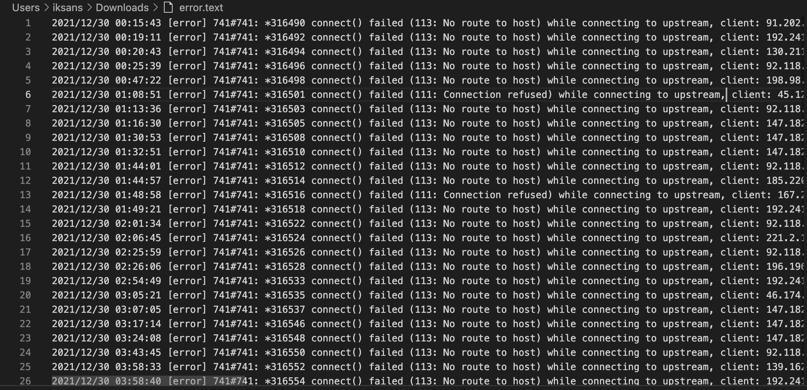
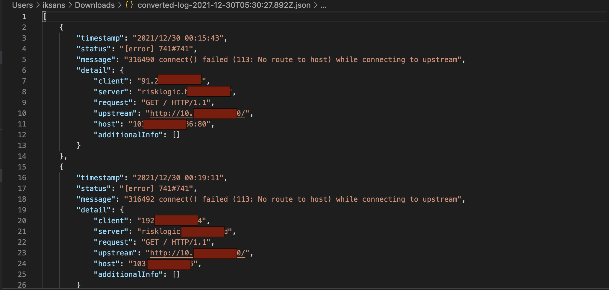

# Telkom Indonesia Backend Engineer Test 

Create your own Command Line Tools(CLI) with NodeJS,
the apps itslef will be get the nginx log file and convert it into plain text or json format

## Requirements
- Linux or Mac Operation System
- Node JS 14.0 or later
- Log file of Nginx or Installed Nginx in the System

## Installation
Installation the application

- Download and Install the latest NodeJS and npm with the command line bellow
```bash
$ sudo apt install nodejs
$ sudo apt install npm
```

- Install the Command Line Tools with the command bellow

```bash
$ npm install
$ npm link
```

- Type the created command line to check if it works
```bash
$ telkom
```
- If the command line is working it will show prompt bellow and

```bash
Help:

    Usage: telkom [ error.log ] [options] 

    Options:
    -                   script read from stdin (default if no file name is provided, interactive mode if a tty)
    --                  indicate the end of node option
    -h, --help          show application help
    -t, --template      option for converting log into json or plain text, if empty the default is plain text
    -o, --output        option for save the converted result

    Documentation can be found at https://github.com/9iksans
```

## DOCUMENTATION

This application can convert nginx log file in /var/log/nginx/error.log or the other directory in system

The example of how to use it will be explained bellow

- Converting the log file to json format
```bash
    $ telkom /var/log/nginx/error.log -t json
```

- Converting the log file to txt format
```bash
    $ telkom /var/log/nginx/error.log -t text
```

The default conversion if user doesn't fill the option if -t or --template is plain text, like the example bellow

```bash
    $ telkom /var/log/nginx/error.log 
```

User can also convert the file into the desired destination with -o or --output option, like the example bellow


```bash
    $ telkom /var/log/nginx/error.log -o /Users/iksans/Downloads/error.txt
```
or 

```bash
    $ telkom /var/log/nginx/error.log -t json -o /Users/iksans/Downloads/error.json
```

When the conversion is complete, terminal will prompt bellow

```bash
    Log file converted successfully
    The written file saved on : ./converted-log-2021-12-30T06:23:39.556Z.json
```


## RESULT
The conversion result of this application are shown whit the image bellow

- Converting to Plain Text format
<figure>
   <center></center>
</figure>

- Converting to JSON
<figure>
   <center></center>
</figure>
 
 
